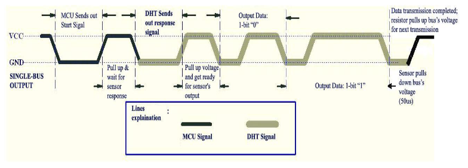
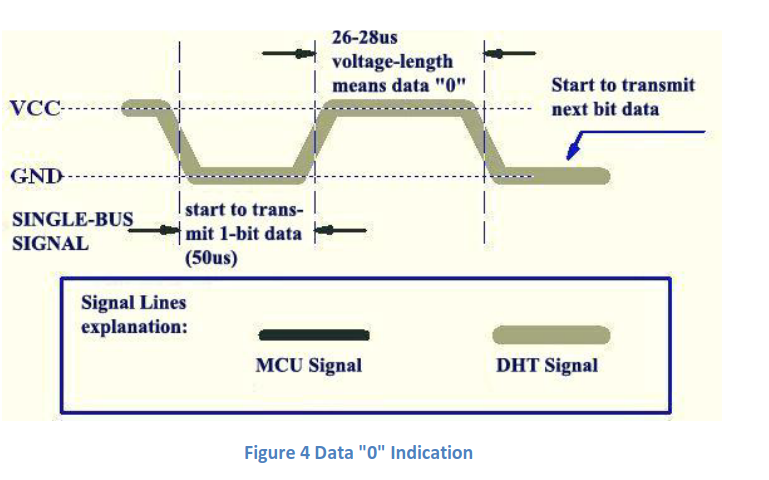
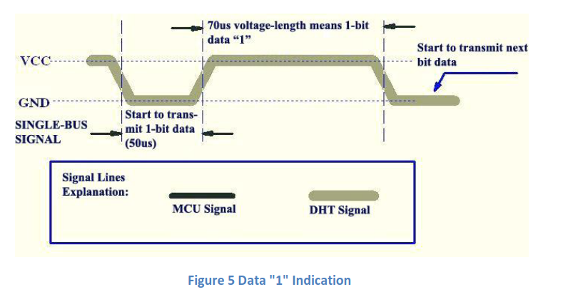

# ESP32 DHT11 IoT Project
This is a simple IoT project that displays the current temperature and humidity on a webpage. The program converts the signal received through the ESP32 GPIO from the DHT11 and converts it to integers that represent the temperature and humidity. Then the data is written into an HTML file so that it can be displayed on the web via an HTTP server on the ESP32. I used ESP-IDF framework for this project.

## Demo


## Usage
Install ESP-IDF framework and set it up according to their documentation.
``` bash
git clone https://github.com/jamesyoung-15/esp32-dht11-server.git
cd esp32-dht11-server
idf.py fullclean
idf.py menuconfig # Go to example configurations and setup Wifi SSID and password
idf.py build
idf.py flash -p /dev/ttyUSB0 #Or whichever location ESP32 is in, also check permissions
```
Server takes a few seconds to work. Since this server serves a static page, the temperature and humidity are not dynamically updated and client has to refresh webpage to see latest temperature.

## Reading from DHT11
Datasheet: https://www.mouser.com/datasheet/2/758/DHT11-Technical-Data-Sheet-Translated-Version-1143054.pdf

Using the datasheet above, we can obtain the tempertaure and humidity readings from the ESP32 GPIO. Below is the basic outline of how it works.

Basic structure:


1. MCU sends out start signal to dht11 by pulling down voltage for at least 18 ms
2. MCU pulls up voltage and waits for dht11 to respond (20-40ms)
3. DHT11 sends out low response signal for 80 us, then pulls up for 80us and readies for data transmission

Relevant Code for instructions above:
```
/*MCU sends out start signal to dht and dht responds*/
void startSignal(void)
{ 
    //set pin to ouput, pull down for at least 18 ms to let dht11 detect signal
    gpio_set_direction(DHT11_PIN, GPIO_MODE_OUTPUT);;      
    gpio_set_level(DHT11_PIN, 0);;       
    ets_delay_us(19*1000); //19ms   

    //pull up and wait for senor response (20-40 us)
    gpio_set_level(DHT11_PIN, 1);;
    ets_delay_us(30);
    gpio_set_direction(DHT11_PIN, GPIO_MODE_INPUT);;

    //dht first sends out response signal then pulls up voltage before starting data transmission
    while(!gpio_get_level(DHT11_PIN));
    while(gpio_get_level(DHT11_PIN));
}

```


4. Data transmission is begins. The 2 diagrams below show us how to distinguish between a "0" data and a "1" data by the high voltage time.




Below is the code implementation to read and distinguish the high and low voltage as data:
```
/*
Read one byte/8 bit of DHT11 data transmission. Starts with 50 us of low voltage to signal new data then a high voltage for data.
High voltage length of 26-28 us means "0", high voltage length greater than that is 1.
*/
uint8_t readData(void)
{ 
    uint8_t i,sbuf=0;
    for(i=0;i<8;i++)
    {
        //shift left by 1 to append new data transmission to least significant bit, eg. 00000001 becomes 00000010
        sbuf<<=1;
        //data transmission starts with low voltage level as signal so we skip this, then we add 30 us delay so that if data is 0 (26-28 us) then voltage after 30 us will pull down to 0
        while(!gpio_get_level(DHT11_PIN));
        ets_delay_us(30);
        //if high voltage after 30us, data was 1. Bitwise OR done so 1 bit will be added to the least significant bit eg. 00000010 becomes 00000011
        if(gpio_get_level(DHT11_PIN))
        {
            sbuf|=1;  
        }
        //if voltage after 30 us is 0, then data was 0. Bitwise OR will be done basically making the least significant bit 0 eg. 00000010 becomes 00000010
        else
        {
            sbuf|=0;
        }
        //
        while(gpio_get_level(DHT11_PIN));
    }
    return sbuf;   
}
```

5. Now that we have the transmitted data in binary, we need to convert it to the relevant integers. There are a total of 40 bits or 5 bytes of data transmitted. The data format is as follows: [int rh, float rh, int temp, float temp, checksum], where each field is 8 bit or 1 byte. 

Relevant code below:
```
/*Use readvalue function to get the 5 bytes needed*/
void getData(struct data *temp)
{
    uint8_t buf[5]={0};

    buf[0]=readData();
    buf[1]=readData();
    buf[2]=readData();
    buf[3]=readData();
    buf[4] =readData();

    //If the data transmission is right, the check-sum should be the last 8bit of "8bit integral RH data + 8bit decimal RH data + 8bit integral T data + 8bit decimal T data".
    if(buf[4] == buf[0]+buf[1]+buf[2]+buf[3])
        temp->status=0; //no error
    else
        temp->status=1; //error
    temp->temperature = buf[2];
    temp->humidity = buf[0];
} 
```

## Connecting to Wifi
Mainly taken from the ESP-IDF wifi-station example [here](https://github.com/espressif/esp-idf/tree/master/examples/wifi/getting_started/station). Didn't change much other than setting up variables SSID and the Wifi password in `idf.py menu-config`.

## Setting up HTTP Server
Mainly referred to the documentation and example [here](https://docs.espressif.com/projects/esp-idf/en/latest/esp32/api-reference/protocols/esp_http_server.html) for implementing the server. For the webpage I stored the static html page in a char array then we use `sprintf` to write the obtained tempertature and humidity data to the html page. 

Below shows how this is done, where we call the relevant functions for getting temperature and humidity values everytime a http request is sent:

```
/* Our URI handler function to be called during GET /uri request */
esp_err_t get_handler(httpd_req_t *req)
{
    /*gpio for temp*/
    gpio_pad_select_gpio(DHT11_PIN);
    startSignal();
    struct data currentData;
    getData(&currentData);
    if(currentData.status==0)
    {    
        printf("Temp=%d, Humi=%d\r\n",currentData.temperature,currentData.humidity);
    }
    else
    {
        printf("DHT11 Error!\r\n");
    }
    //char htmlPage[]="URI GET Response";
    char htmlPage[BUFFERSIZE]={0};
    sprintf(htmlPage,"<<!DOCTYPE html><html>\n<head>\n<style>\nhtml {font-family: sans-serif; text-align: center;}\n</style>\n</head>\n<body>\n<div>\n<h1>ESP32 IoT Server</h1>\n</div>\n<div>\n<h3>Temperature and Humidity Monitor</h3>\n<p>DHT11 Temperature Reading: %d&deg;C</p>\n<p>DHT11 Humidity Reading: %d%%</p>\n</div>\n</body>\n</html> >",currentData.temperature,currentData.humidity);
    httpd_resp_send(req, htmlPage, HTTPD_RESP_USE_STRLEN);
    return ESP_OK;
}
```
While this doesn't allow for a "live" dynamic realtime monitoring, it shows the temperature at the given time the webpage is requested.

## Next Steps
As mentioned above, this server only shows a static page without realtime monitoring. This is the next feature I wish to implement in this project. Also I can add more modules/sensors.